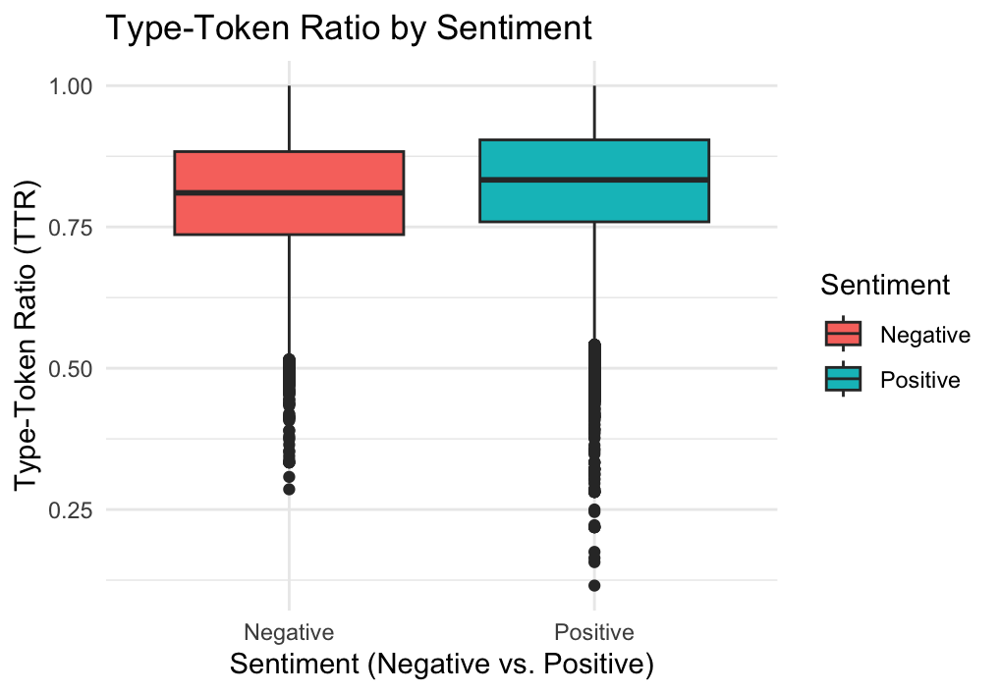
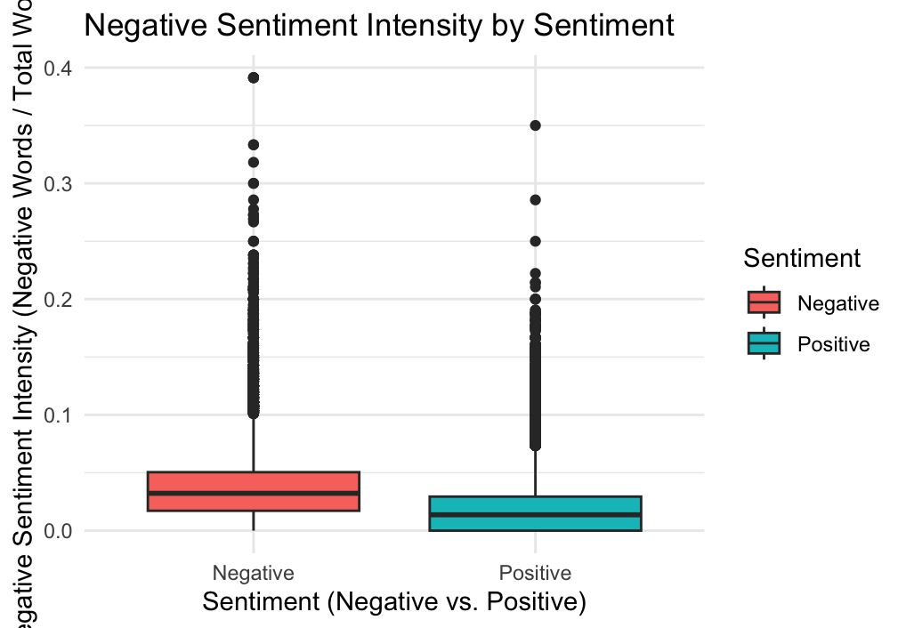

# Lexical Diversity and Sentiment Intensity in Amazon Fine Food Reviews

_LING-460: Textual Analysis with R at UNC-Chapel Hill, Spring 2025._

## Table of Contents

1. [Motivation](#motivation)  
2. [Research Question](#research-question)  
3. [Research Hypothesis](#research-hypothesis)  
4. [Prediction](#prediction)  
5. [Procedure](#procedure)  
6. [Analysis Results](#analysis-results)  
   - [Descriptive Statistics](#descriptive-statistics)  
   - [Statistical Tests](#statistical-tests)  
   - [Regression Analysis](#regression-analysis)  
7. [Data Analysis](#data-analysis)
8. [Visualizations](#visualizations)
9. [Conclusions](#conclusions)  
10. [References](#references)  

## Motivation

Consumer reviews provide rich insights into the evaluative language that people use to express their satisfaction or dissatisfaction. The way consumers articulate their experiences can reveal underlying linguistic patterns, where factors such as lexical diversity and emotional tone contribute to the expression of opinions. Understanding these patterns has implications for marketing, consumer research, and sentiment analysis in natural language processing. Our project addresses the broader question of whether the language used in negative reviews differs fundamentally from that used in positive reviews.

## Research Question

**Do negative reviews exhibit lower lexical diversity and higher negative sentiment intensity than positive reviews?**

- *Lexical diversity* is measured by the type-token ratio (TTR), which quantifies the ratio of unique words to the total number of words in a review.
- *Negative sentiment intensity* is measured by the proportion of negative words (using a standard sentiment lexicon) to the total words in a review.

## Research Hypothesis

We hypothesize that:
- **H₁a:** Negative reviews (with 1-2 star ratings) will have lower lexical diversity (i.e., a lower type-token ratio) compared to positive reviews (with 4-5 star ratings).
- **H₁b:** Negative reviews will exhibit higher negative sentiment intensity (i.e., a higher proportion of negative words) than positive reviews.

## Prediction

Based on the hypotheses:
- If **H₁a** is correct, then the average TTR for negative reviews should be significantly lower than that for positive reviews.
- If **H₁b** is correct, then the average negative sentiment intensity (ratio of negative words to total words) should be significantly higher for negative reviews than for positive reviews.

## Procedure

Our approach involved the following steps:

1. **Data Acquisition:**  
   We used the publicly available Amazon Fine Food Reviews dataset from Kaggle, containing over 500,000 reviews with ratings spanning from 1 to 5 stars.

2. **Data Preprocessing:**  
   - Converted Unix timestamps in the `Time` column to human-readable dates.
   - Ensured that the `Score` field was numeric.
   - Classified reviews into three sentiment groups based on the score: Negative (1-2 stars), Positive (4-5 stars), and Neutral (3 stars). Only Negative and Positive reviews were retained for the analysis.
   - Computed the Type-Token Ratio (TTR) for each review as an indicator of lexical diversity.

3. **Sentiment Analysis:**  
   - Using the "bing" sentiment lexicon from the `tidytext` package, we tokenized the review texts and counted the frequency of negative words.
   - Calculated negative sentiment intensity as the proportion of negative words to the total number of words in each review.

4. **Statistical Testing:**  
   - We performed two independent-sample t-tests to compare the TTR and negative sentiment intensity between negative and positive review groups.
   - A linear regression model was constructed to assess the combined effect of review sentiment and negative sentiment intensity on lexical diversity.

5. **Visualization:**  
   - Boxplots were generated to visually compare the distributions of TTR and negative sentiment intensity between the two sentiment groups.
   - Regression visualizations (scatter plots with fitted linear models and faceted views) were created to illustrate the relationship between TTR and negative sentiment intensity by sentiment group.

## Analysis Results

### Descriptive Statistics

| Sentiment | Mean TTR | SD TTR | Mean Negative Intensity | SD Negative Intensity | Count  |
|-----------|----------|--------|-------------------------|-----------------------|--------|
| Negative  | 0.807    | 0.102  | 0.0368                  | 0.0296                | 82,037 |
| Positive  | 0.827    | 0.100  | 0.0179                  | 0.0206                | 443,777|

**Interpretation:**  
Negative reviews have a lower average TTR and higher negative sentiment intensity compared to positive reviews.

### Statistical Tests

- **T-Test for TTR:**  
  - *t-value*: -52.162  
  - *Degrees of freedom*: ≈113,371  
  - *p-value*: < 2.2e-16  
  - **Interpretation:** There is a statistically significant difference in TTR, with negative reviews having lower lexical diversity.

- **T-Test for Negative Sentiment Intensity:**  
  - *t-value*: 174.36  
  - *Degrees of freedom*: ≈97,254  
  - *p-value*: < 2.2e-16  
  - **Interpretation:** There is a statistically significant difference in negative sentiment intensity, with negative reviews having a higher proportion of negative words.

### Regression Analysis

The linear regression model predicting TTR using a binary sentiment indicator and negative sentiment intensity produced the following results:

- **Intercept:** ~0.827 (baseline TTR for positive reviews)  
- **Coefficient for SentimentBinary:** ~ -0.02039 (highly significant, p < 2e-16)  
  *Interpretation:* Negative reviews have a TTR about 0.02 lower than positive reviews.
- **Coefficient for NegativeIntensity:** ~0.01196 (marginally significant, p ≈ 0.055)  
  *Interpretation:* A slight positive association between negative sentiment intensity and TTR is observed, though this effect is less pronounced.

## Data Analysis

Our analysis included:
- **Descriptive Comparison:**  
  The summary statistics indicated clear differences in both TTR and negative sentiment intensity between negative and positive reviews.

- **Statistical Testing:**  
  Both independent-sample t-tests resulted in highly significant differences between the groups (p < 2.2e-16). The significant t-test results for TTR confirm that negative reviews use more repetitive language (lower lexical diversity) than positive reviews. The t-test results for negative sentiment intensity demonstrate that negative reviews incorporate a higher proportion of negative words.

- **Regression Modeling:**  
  The regression analysis further supported these findings. The significant negative coefficient for the sentiment binary variable confirmed that negative sentiment is associated with reduced lexical diversity. Although the contribution of negative intensity to TTR was marginally significant, its inclusion in the model offers additional nuance to the relationship between review language and sentiment.

## Visualizations

The report includes the following key visualizations:
- **Figure 1:** Boxplot of Type-Token Ratio (TTR) by review sentiment.

   

- **Figure 2:** Boxplot of Negative Sentiment Intensity by review sentiment.

   

## Conclusions

Based on our analyses, we conclude the following:
- **Lexical Diversity:**  
  Negative reviews exhibit significantly lower lexical diversity (i.e., a lower TTR) than positive reviews. This supports our hypothesis that more negative reviews tend to be more repetitive in their language use.
  
- **Negative Sentiment Intensity:**  
  Negative reviews have a significantly higher intensity of negative words compared to positive reviews, indicating a more emotionally charged language in negative reviews.
  
- **Regression Findings:**  
  The regression model reinforces these findings by revealing that review sentiment is a significant predictor of TTR. Even though the effect of negative sentiment intensity on lexical diversity was less pronounced, the overall model confirms that sentiment plays an important role.
  
**Implications:**  
These conclusions suggest that evaluative language in negative reviews is characterized by less lexical variety and a greater focus on negative sentiment. This may have implications for improving sentiment analysis tools, refining review summarization techniques, and understanding consumer behavior.

**Future Directions:**  
Further research could explore additional linguistic features (e.g., syntactic complexity, use of modifiers) or investigate how these patterns might evolve over time. Additionally, comparing these findings with other types of online reviews could provide broader insights.

## References

- McAuley, J., & Leskovec, J. (2013). *From Amateurs to Connoisseurs: Modeling the Evolution of User Expertise through Online Reviews*. [DOI: 10.48550/arXiv.1303.4402](https://doi.org/10.48550/arXiv.1303.4402)
- Stanford Network Analysis Project Team (2017). *Amazon Fine Food Reviews*. Kaggle. [Link to dataset](https://www.kaggle.com/datasets/snap/amazon-fine-food-reviews)

---
